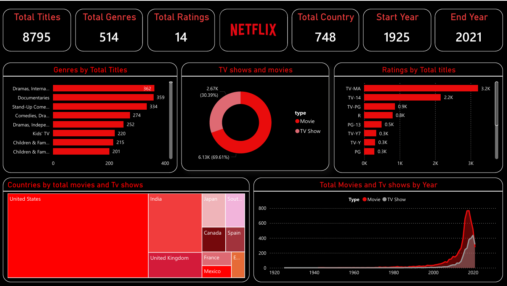

# Netflix Data Analysis & Interactive Power BI Dashboard

## 📌 Project Overview
This project presents an **end-to-end data analytics workflow** using Netflix titles data.  
The dataset was cleaned and transformed using **Python (Pandas & NumPy)** and visualized through an **interactive Power BI dashboard** to extract meaningful insights about Netflix content trends.

The project demonstrates real-world **data analyst skills**, including data cleaning, exploratory analysis, KPI creation, and business-focused data storytelling.

---
## 📊 Dashboard Preview

## 🛠️ Tech Stack
- **Python**: Pandas, NumPy  
- **Power BI**: Data modeling, DAX, interactive visuals  
- **Excel**: Data validation & intermediate checks  
- **GitHub**: Version control & documentation  

---

## 📂 Dataset Information
- Source: Netflix Titles Dataset  
- Content: Movies & TV Shows available on Netflix  
- Key Columns:
  - Title
  - Type (Movie / TV Show)
  - Genre(s)
  - Country
  - Rating
  - Release Year
  - Duration

---

## 🔄 Data Cleaning & Preparation (Python)
Data preprocessing was performed using **Pandas and NumPy**, including:

- Removal of duplicate records  
- Handling missing values in country, rating, and genre columns  
- Normalization of multi-value fields (genres, countries)  
- Data type corrections and formatting  
- Preparation of clean, analysis-ready data for Power BI  

The cleaned dataset was exported and directly used for visualization.

---

## 📊 Power BI Dashboard Features

### 🔹 KPI Cards
- Total Titles  
- Total Genres  
- Total Ratings  
- Total Countries  
- Start Year & End Year  

### 🔹 Visual Analysis
- **Genres by Total Titles** – Identifies dominant content categories  
- **TV Shows vs Movies** – Content distribution comparison  
- **Ratings by Total Titles** – Audience maturity insights  
- **Countries by Total Titles** – Global content footprint  
- **Total Movies & TV Shows by Year** – Growth trend over time  

### 🔹 Interactivity
- Dynamic filters  
- Drill-down analysis  
- Responsive visuals for deeper exploration  

---

## 🔍 Key Insights
- Netflix content grew rapidly after 2010  
- Movies dominate the platform compared to TV shows  
- TV-MA and TV-14 are the most common ratings  
- The United States contributes the highest number of titles  
- Drama and Documentary are among the most prevalent genres  

---

## 📈 Business Value
This dashboard helps stakeholders:
- Understand content growth and distribution trends  
- Analyze audience maturity and rating patterns  
- Identify dominant genres and regional content contributions  
- Support data-driven content strategy decisions  

---

## 🚀 How to Use
1. Clone the repository  
2. Open the Power BI `.pbix` file  
3. Interact with slicers and visuals to explore insights  

---

## 📁 Project Structure
 ┣ 📄 README.md
 ┣ 📄 netflix_titles.csv
 ┣ 📄 cleaned_data.xlsx
 ┣ 📄 netflix_dashboard.pbix
 ┣ 📄 data_cleaning.ipynb

---

## 🧠 Skills Demonstrated
- Data Cleaning & Wrangling  
- Exploratory Data Analysis (EDA)  
- DAX Measures & KPIs  
- Dashboard Design & Visual Storytelling  
- Business Insight Generation  

---

## ✨ Why This Project Stands Out
✔ End-to-end analytics workflow  
✔ Real-world dataset  
✔ Clean and interactive dashboard  
✔ Business-focused insights  
✔ Recruiter & ATS friendly  

---

## 👤 Author
**Salman Majeed**  
Data Analyst | Python | SQL | Power BI  

---

⭐ If you found this project useful, feel free to star the repository!
